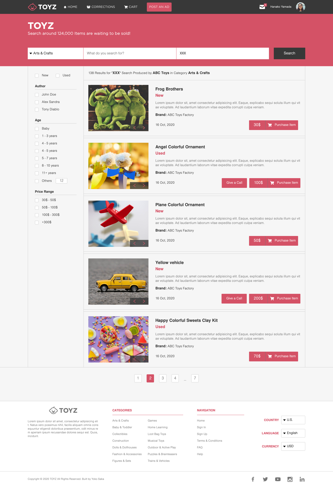

## About the Project

This project is based on an online shop for electronics.
Instead of that content, I built an online shop for kids' toys with 2 pages as below:

- the main page (search page), with a link to the results page: [index.html](https://raw.githack.com/yocosaka/online-shop/shop/index.html)
- the search results page: [results.html](https://raw.githack.com/yocosaka/online-shop/shop/results.html)

Each of these pages has versions for mainly 2 different screen sizes

- mobile: up to 768px
- tablet & desktop: from 768px

Plus, I added 4 breakpoints to these pages

- tiny mobile: up to 420px
- small mobile: from 460px
- laptop: from 960px
- large desktop: from 1200px

I followed the guidelines of the given design, including:

- colors
- typographies: font face, size, and weight
- layout: composition and space between elements, for the 2 given screen sizes

Please note that some fonts face are used as alternative fonts of Helvetica Neue Light, Medium, and bold because they are not available for free.

A list of commonly used resources that I find helpful is listed in the acknowledgments.

## Table of Contents

* [About the Project](#about-the-project)
  * [Built With](#built-with)
* [Live Demo](#live-demo)
* [Getting Started](#getting-started)
* [Contributing](#contributing)
* [Show your support](#show-your-support)
* [License](#license)
* [Author](#author)
* [Acknowledgements](#acknowledgements)

### Built With

* [HTML5](https://en.wikipedia.org/wiki/HTML5)
* [SASS(SCSS)](https://sass-lang.com/)
* [JavaScript](https://en.wikipedia.org/wiki/JavaScript)

## Live Demo

[Live Demo Link](https://raw.githack.com/yocosaka/online-shop/shop/index.html)

## Getting Started

Just clone this repo and open index.html file in your browser then you are good to go.
To get a local copy up and running, clone the repo.

## Contributing

Contributions, issues, and feature requests are welcome!
Feel free to check the [issues page](../../issues).

1. Fork the Project
2. Create your Feature Branch (`git checkout -b feature/AmazingFeature`)
3. Commit your Changes (`git commit -m 'Add some AmazingFeature'`)
4. Push to the Branch (`git push origin feature/AmazingFeature`)
5. Open a Pull Request

## Show your support

Give a ⭐️ if you like this project!

## License

["ZATTIX"](https://www.behance.net/gallery/24796463/ZATTIX) design idea [Mohammed Awad on Behance](https://www.behance.net/M_Awad) is licensed under [Creative Commons license of the design](https://creativecommons.org/licenses/by-nc/4.0/) licensed.

## Author

👤 **Yoko Saka**

- GitHub: [@yocosaka](https://github.com/yocosaka)
- Twitter: [@yocosaka](https://twitter.com/yocosaka)
- LinkedIn: [Yoko Saka](https://www.linkedin.com/in/yokosaka)

## Acknowledgements
* [pixabay](https://pixabay.com/)
* [pexels](https://www.pexels.com/)
* [rawpixel](https://www.rawpixel.com/)
* [iconify](https://iconify.design/)
* [Gotham Font Family](https://freefontsfamily.com/gotham-font-family/)
* [Gotham Rounded Light](https://fontsgeek.com/fonts/Gotham-Rounded-Light)
* [Nimbus Sans Light](https://fontsup.com/font/nimbus-sans-d-ot-light.html)
* [Pragmatica Medium](https://www.fontsmarket.com/font-download/pragmatica-medium)
* [Free Sans Bold](https://www.dafontfree.io/helvetica-neue-font-free/)
